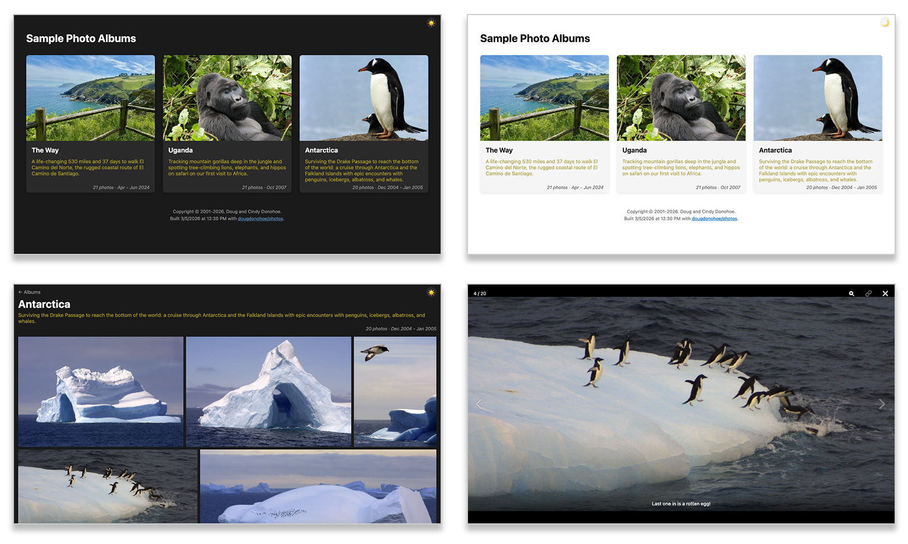

# DD Photos - Photo Album Website

## Motivation

I was dissatisfied with photo sharing sites, especially Apple's iCloud shared albums,
which typically take 20+ seconds to load.  Other sites for sharing have their own 
irritations like cumbersome UIs, advertising, hawking of photo paraphernalia and
social media distractions.

I just want to share my photos with friends and family.  I want it fast, easy, mobile
friendly, and distraction free. Focus on the photos. So I built this,
with help from Claude Code, and it is what is behind
[photos.donohoe.info](https://photos.donohoe.info).
It's pretty good and meets my needs.  Maybe it will meet yours
too, which is why I've open-sourced it.

## Overview

The site has a home page, with all of your albums and their description.
You can easily switch between dark and light themes.  Click/touch an album and 
you see a grid of all photos.  Click/touch a photo to see the full size version and
a caption, if it has one. You can easily swipe between photos (or use
arrow keys on a laptop).  It works great on mobile, tablet, and desktop.

Here's what it looks like on a big display (see [SCREENSHOTS.md](docs/SCREENSHOTS.md) for larger versions):



## How it Works

The idea is that you already use _something else_ to curate and filter your photos. Maybe it
is Adobe Lightroom Classic (my tool).  Or maybe it is Apple Photos or Google Photos.
It doesn't matter, but once you get a selection of photos that comprise an album,
you export the photos into a folder.  All the photos in a folder make up an album.
It's that simple.

You can create an optional `photogen.txt` file in each album folder to
define captions for each photo.  This file can also be used to define the
album's sort order, if order-by-date isn't sufficient.

With DD Photos, you define where your albums live in an `albums.yaml` file.
In a separate `descriptions.txt` you provide a short description of each album.

Once you have defined where your photos live, you run the `photogen` tool,
which resizes the photos for web viewing and generates index files that
the web app uses.

That's it.  Now, you can easily view your photo albums on your machine using the dev server.

Finally, there is a build step which creates a static site that can easily be
deployed to a machine that has a web server (like Apache) or theoretically
something like AWS S3.  No code runs on a server.  No database is needed.
It's just HTML, CSS, JavaScript and your (resized) photos.

## Key Features

Website features:

- Concise album cards with description, number of photos, date range and
  your choice of cover photo.
- Album page has a nicely justified photo grid layout with PhotoSwipe lightbox that
  adjusts well to any screen size.
- Keyboard support: arrow keys navigate in lightbox, ESC key exits
  lightbox and returns to home page from album page.
- Optional per-photo descriptions via `photogen.txt`: used as image "alt" text, grid
  mouse-hover caption (desktop), always-visible caption (mobile), and lightbox caption.
- Each photo has a shareable permalink (e.g., `/albums/patagonia/5`) accessible via a copy-to-clipboard button.
- Dark/light theme toggle.
- OpenGraph tags for rich link previews when sharing album or photo URLs on social media
  or messaging apps, using a JPEG version of the album cover photo as the preview image.

Backend features:

- Two efficient WebP image sizes created: `grid` (600px) and `full` (1600px).
- EXIF metadata extraction (dimensions, date) stored in JSON.
- All image metadata stripped from WebP output (smaller files, no GPS leak).
- Concurrent image resizing via goroutines (buffered channel, WaitGroup).
- Dry-run mode by default (use `-doit` to write files).
- Optionally use `photogen.txt` to override sort order (default is by capture date).

## Tech Details

The `photogen` Go program (`cmd/photogen/photogen.go`) resizes your photos to WebP
format and generates the JSON index files (`albums.json`, per-album `index.json`) 
that are consumed by the frontend.  It also generates a `sitemap.xml` file that
identifies each album.

The site (in `web`, a Node.js app) is built with SvelteKit and statically generated. 
The HTML shell and assets are pre-built files served directly by a web server, with photo data 
fetched client-side from the static JSON indexes generated by `photogen`.

There are many ways to deploy a static site like this. It is somewhat outside the scope
of this project to tackle all the various deployment strategies, but I may add more
options in the future if there is interest.

That said, I happen to already run an Apache server on an AWS EC2 instance that is fronted 
by CloudFront.  Deployment for me is an `rsync` to this server, and I've included the 
script which does this.  My actual AWS setup is maintained in Terraform files in a
private repo, but I provide some details in the [README-DEV](README-DEV.md)
for those that are curious.  Part of what makes my photos site fast is the use of the CDN
and the fact that the site is entirely static.

## Prerequisites

The following setup instructions are Mac-centric (via [Homebrew](https://docs.brew.sh/Installation)). Linux should work with 
equivalent package manager commands (`apt`, `yum`). Windows users should use WSL2.

```bash
# Install Go, vips library and pkg-config dependency (for photogen)
brew install go vips pkg-config

# In root of this repo, fetch Go libraries
go mod download
```

The website is a Node.js app. Install
[nvm](https://github.com/nvm-sh/nvm#installing-and-updating) first if
you don't already have it.

```bash
# Install Node and dependencies (for the web app):
make web-nvm-install  # installs the Node version specified in web/.nvmrc
make web-npm-install  # install npm dependencies

# Optional: Install playwright dependencies if running e2e tests
make web-playwright-install  # installs Playwright + Chromium for e2e tests
```

You may also want to install [Docker](https://www.docker.com/get-started/) if
you don't have it, as it is required for testing site behavior using Apache.

## Sample App

Once you have the required software installed, you should be able to
build and view the sample site provided within this repo (in the `sample` dir).

```bash
# Resize photos and generate .json files
make sample-photogen

# Run dev server
make sample-npm-run-dev
```

You should see a `VITE` message and a browser window should
open at [localhost:5173](http://localhost:5173/).

You can also build the static site and test it in Apache (requires Docker and
assumes `photogen` has been run).

```bash
# Build docker image (one time)
make web-docker-build

# Build sample site
make sample-build

# Run it in Docker/Apache
make web-docker-run 
```

You should be able to see the site at [localhost:8080](http://localhost:8080).

**Congratulations!**  Now that you've got the sample site working, you can
work on your own albums.  You can start first by adding to the sample config
in `sample/config/albums.yaml`.  Or you can start building your own using the
examples in `config`.  The sections below provide details about how everything
works.

## Configuration

There are three configuration files one needs to build a site:

* `albums.yaml` - Defines your list of albums, an id for the site (useful if
  you have multiple sites), and the locations of your photos.
* `descriptions.txt` - The description of the album that you see. This
  is in a separate file to allow sharing of albums across sites (useful in development), 
  and also enables localization in the future.
* `site.env` - Global values like site name, description and copyright info.

The `config` directory contains examples of each, and serves as detailed
documentation of each parameter.  The `sample/config` files are a working 
example that drives our "Sample Photo Album".

The `config` directory is the default, so feel free to put your config
files there (just copy the examples and edit them).  Or edit the sample
app.  Or create your own config directory and use the `--config-dir`
option.

```bash
cp config/albums.example.yaml config/albums.yaml
cp config/descriptions.example.txt config/descriptions.txt
cp config/site.example.env config/site.env
```

**TIP**: If you use `prod` as your `settings.id` value in `albums.yaml`,
you can use some provided make targets, like `use-prod`.

## Commands

The `Makefile` is a good reference for the commands (you used them to run the sample site).
Assuming you put your config files in `config`, these commands are useful:

### Resize and Index

```bash
# Dry run of indexing and resizing
go run cmd/photogen/photogen.go -resize -index

# Do it for real
go run cmd/photogen/photogen.go -resize -index -doit
```

**NOTE**: output goes to `web/albums/[ID]` by default.  For example,
the sample site is in `web/albums/sample`.  A symlink from
`web/static/albums` points to the current site data you are working
with.  See the `use-prod` Makefile target for an example of
how this symlink is created.

### Run Site

Once `photogen` has been successfully run, you can run the
dev server.

```bash
# Make sure symlink is correct
ln -sfn ../albums/my-site web/static/albums # if id is not 'prod'
make use-prod # if id is 'prod'

# Run dev server
make web-npm-run-dev
```

### Build and Test Apache

To test the build process:

```bash
make web-npm-build
```

This deletes and recreates the `web/build` directory, which will have all
the files needed to run the site, including copies of your resized photos.

To run it using the Docker/Apache image:

```bash
make web-docker-run
```

You should be able to see the site at [localhost:8080](http://localhost:8080).

### Test Site

Assuming the dev server is running, you can run the playwright tests:

```bash
make web-playwright-test-dev
```

These should pass against `sample`, but some will fail against your site,
because values are hardcoded at the moment (i.e., the smoke/caption tests 
reference specific album names - `antarctica` and `uganda`).

You can also run some smoke tests as defined in `bin/test-photos-apache.sh`.
Assuming Docker/Apache is running:

```bash
make web-docker-test
```

If Docker/Apache isn't running, you can auto-start and stop it to
run these tests against sample site:

```bash
make sample-test-apache
```

## Developer Information

See [README-DEV](README-DEV.md) for more details about `photogen`, the
SvelteKit site, deployment and other technical details.

## Project History

Much of this project was built with Claude Code. See [HISTORY.md](docs/HISTORY.md)
for a detailed session log covering WebP conversion, concurrent image resizing,
static site setup, Apache URL routing and Docker test environment, photo
descriptions and captions, photo permalinks, Open Graph and social sharing tags,
SvelteKit client-side navigation, Playwright E2E tests, YAML-based album
configuration, deploy scripts, open-source prep, and more.

## License

This project is licensed under the [GNU Affero General Public License v3.0](LICENSE.txt) (AGPL v3).

If you'd like to use this project under different terms, contact doug [at] donohoe [dot] info.
